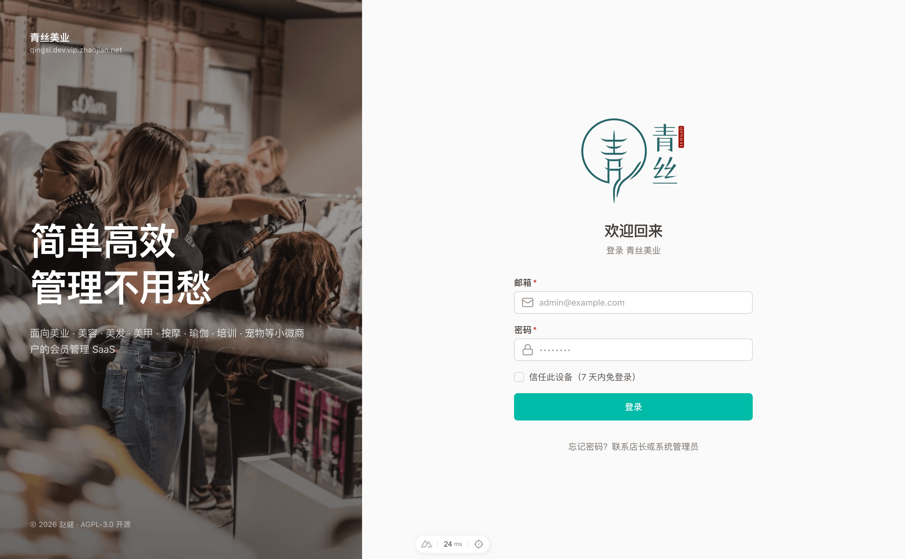
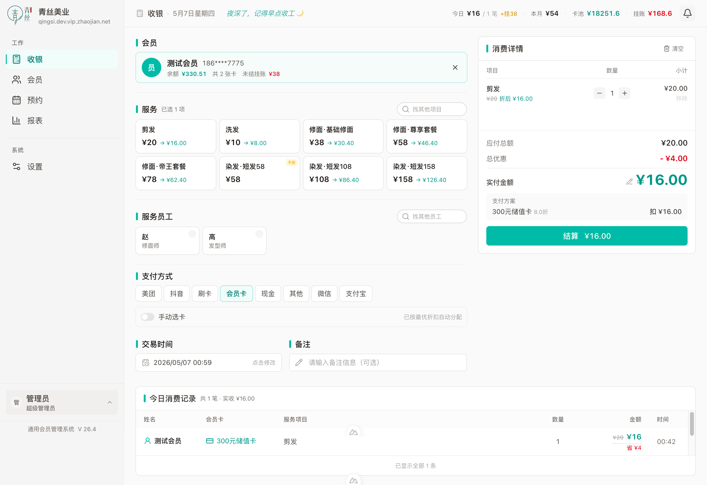

# 通用会员管理系统 · SaaS 版

**简单高效，管理不用愁，经营更省心**

面向小微商户的多租户 SaaS 会员管理平台。代码 AGPL-3.0 开源。

适用于：**美业、美容、美发、美甲、按摩、瑜伽、培训、宠物**等行业。

## 预览



登录页：图形验证码 + 行业主题背景（美业 / 瑜伽 / 宠物等多套预设）。



POS 收银工作区：选项目 / 多卡组合扣费 / 价格调整 / 一键结算。


系统设置：店铺品牌、服务项目、卡型、员工、支付方式、撤单授权集中管理。

## 功能

| 模块 | 功能 |
|------|------|
| 收银台 | 快速结算、多支付方式、会员卡支付、智能多卡组合、价格调整 |
| 会员管理 | 会员档案、办卡充值、余额查询、挂账管理、消费记录 |
| 预约管理 | 顾客端在线预约（扫码直达）、状态追踪、预约码一键重置 |
| 营业报表 | 营业概览、支付统计、项目排行、会员卡销售、生日提醒、沉睡会员 |
| 系统设置 | 店铺品牌 / 服务项目 / 卡类型 / 员工 / 支付方式 / 账号 / 交易撤销 / 预约配置 |
| 操作日志 | 所有写操作追加审计，append-only 触发器拒绝 UPDATE/DELETE |
| 多租户 | 每个商户独立数据 + 独立子域名 + 独立品牌（PostgreSQL FORCE RLS 隔离） |
| 多店员 + 权限 | 超级管理员 / 管理员 / 员工 三级权限 + JWT token 版本吊销 |
| 通知与公告 | 顶部铃铛实时提醒（生日 / 预约待确认 / 系统公告）+ 侧边栏版本号 + changelog 页 |
| 运营后台 | `admin` 子域独立入口：商户开通 / 续期改套餐 / 停用恢复 / 重置商户管理员密码 / 套餐价格与限额管理 |
| 自助申请 | 主站 `/apply` 公开申请表单（验证码防刷），运营审批通过即自动建号 |
| 套餐限额 | hosted 模式按套餐执行会员数 / 员工数上限（事务内锁行防超发），商户端到期提示条 |

**计费支付（线上续费）、行业模块** 规划中，当前版本未实现。

## 技术栈

- 前端：Nuxt 4 + Nuxt UI v4
- 后端：Go 1.26 + Echo v5
- 数据库：PostgreSQL 18（行级安全 RLS 实现多租户隔离）
- 查询：sqlc + pgx/v5 + shopspring/decimal（金额全链路类型安全）
- 迁移：goose
- 部署：Docker Compose + 1Panel（OpenResty 反代 + 证书管理）

## 三种部署模式

| 模式 | 适用 | 说明 |
|---|---|---|
| **官方托管**（`hosted`） | 普通商户 | 官方运营的托管服务（自助注册与计费订阅在阶段 4+ 开放） |
| **社区自建**（`self-hosted`） | 技术用户 / 个人店面 | 开源免费，自己搭服务器 |
| **企业私有部署**（`enterprise`） | 连锁品牌 / 合规客户 | 合同定制，支持定制开发和 SLA |

通过环境变量 `DEPLOYMENT_MODE` 切换。

## 快速开始（自建）

### 1. 克隆项目

```bash
git clone https://github.com/zhaojiannet/mms.git
cd mms
```

### 2. 配置环境变量

```bash
cp .env.example .env
```

编辑 `.env` 填写密码和密钥（参考注释）。生成密钥：`openssl rand -hex 64`

### 3. 启动服务

```bash
docker compose up -d
```

### 4. 首次进入

全新的库里没有任何商户，第一个商户由运营后台开通：

1. 后端 health：http://localhost:8081/health（宿主 8081 → 容器 8080）
2. 打开运营后台 http://localhost:3001/platform ，用 `.env` 的 `PLATFORM_ADMIN_EMAIL` + `PLATFORM_ADMIN_PASSWORD` 登录（首次启动自动创建）
3. 开通第一个商户，自己定 slug；返回的管理员密码只显示这一次，当场记下
4. 本地没有子域可用，把该 slug 填进 `.env` 的 `NUXT_PUBLIC_TENANT_SLUG` 后重启前端容器，再访问 http://localhost:3001 用商户管理员登录
5. 首次登录会被要求先改密码——开通时那个密码是运营员生成、经人手转达的，不改掉等于运营方长期持有该账号。改完需用新密码重新登录（改密会吊销所有已签发 token）

## 套餐（仅官方托管）

| 套餐 | 月付 | 年付 | 会员 | 员工 | 门店 | 微信推送/月 |
|---|---|---|---|---|---|---|
| **免费版** | ¥0 | — | 100 | 2 | 1 | 100 |
| **Plus** | ¥9.9 | ¥99 | 1000 | 10 | 1 | 1000 |
| **Pro** | ¥39.9 | ¥399 | 5000 | 50 | 3 | 5000 |
| **Ultra** | ¥199.9 | ¥1999 | 无限 | 无限 | 无限 | 无限 |
| **企业版** | 合同 | — | 私有部署 + 定制开发 + SLA | | | |

所有套餐均解锁**全部功能**，差异仅在数量与推送配额（以及 Ultra 的行业模块包）。

「员工」同时约束两个维度，各自不超过该数：**员工名册**（开单选服务人员、算提成）与**登录账号**（含店主本人的账号）。会员数与这两项上限已即刻执行，门店数与推送配额待对应功能上线后生效。价格与限额均可在运营后台随时调整。

自建版**无套餐限制**（所有配额项视为无限）。

## 多租户 / 商户子域访问

每个商户访问自己的专属子域：

```
<slug>.vip.zhaojian.net         如 mystore.vip.zhaojian.net
```

子域后缀由 `.env` 的 `NUXT_PUBLIC_APP_DOMAIN` 决定，开发与生产各配一个即可。

数据隔离基于 PostgreSQL Row Level Security：数据库强制执行按 `tenant_id` 过滤，即使代码写错也不会跨租户泄露。

## 品牌定制（每个商户独立）

商户在"设置 → 店铺"里配置：
- 店铺名称、Logo（上传 PNG/JPG/WebP，启动时剥离 polyglot payload）
- 登录背景主题（美业 / 美容 / 美发 / 美甲 / 按摩 / 瑜伽 / 培训 / 宠物 等预设）

## 微信 / 短信通知推送

**当前版本未实现**，规划中。已有"顶部铃铛 + 站内通知"作为替代。

## 生产部署（1Panel）

推荐用 [1Panel](https://1panel.cn/) 管理。

### 服务器初始化（一次性）

1. 1Panel 应用商店装 OpenResty
2. 在 1Panel "网站" 给**每个商户**建一个反代站点（`<slug>.vip.zhaojian.net`，DNS 手动加 A 记录），站点配置内按路径分流。`proxy_set_header Host $host` 一行都不能少：后端靠 Host 从子域解析租户，传丢了整站 404，运营后台的主机名校验也会失效：

   ```nginx
   location /api/ {                                    # Go 后端
       proxy_pass http://127.0.0.1:8081;
       proxy_set_header Host              $host;
       proxy_set_header X-Real-IP         $remote_addr;
       proxy_set_header X-Forwarded-For   $proxy_add_x_forwarded_for;
       proxy_set_header X-Forwarded-Proto $scheme;
       proxy_http_version 1.1;
       proxy_set_header Connection "";
       proxy_read_timeout 60s;
   }
   location /uploads/ {                                # 店铺 logo 等上传资产
       proxy_pass http://127.0.0.1:8081;
       proxy_set_header Host $host;
       proxy_http_version 1.1;
       proxy_set_header Connection "";
   }
   location = /health {
       proxy_pass http://127.0.0.1:8081;
       proxy_set_header Host $host;
       access_log off;
   }
   location / {                                        # Nuxt 前端
       proxy_pass http://127.0.0.1:3001;
       proxy_set_header Host              $host;
       proxy_set_header X-Real-IP         $remote_addr;
       proxy_set_header X-Forwarded-For   $proxy_add_x_forwarded_for;
       proxy_set_header X-Forwarded-Proto $scheme;
       proxy_http_version 1.1;
       proxy_set_header Upgrade $http_upgrade;
       proxy_set_header Connection "upgrade";
   }
   ```

   反代落在本机回环，`.env` 记得配 `TRUSTED_PROXIES=127.0.0.1/32,::1/128`，否则 `ClientIP` 只看得到 `127.0.0.1`，per-IP 限流会把所有访客算作同一个来源——任何人打满登录限额，全站一分钟内都登不进去。

3. 每个站点单独申请 Let's Encrypt 证书（HTTP 验证，自动续期）。有意不用通配符证书：通配须 DNS 验证，等于把域名解析的 API 密钥存进服务器；单域手动建站每商户约 5 分钟，规模上来（约 30 商户/月）再考虑自动化
4. 另建两个平台站点（配置与商户站点相同的路径分流）：
   - 运营后台（商户管理 / 申请审批 / 套餐管理）：主机名由 `PLATFORM_HOST` 指定，留空则默认 `admin.<APP_DOMAIN>`。换个不好猜的名字本身也是一层防护。操作员账号由 `.env` 的 `PLATFORM_ADMIN_*` 首次启动创建
   - 主域名 `vip.zhaojian.net` → 产品主页，`/apply` 为商户开通申请表单
4. clone 仓库到服务器（如 `/opt/mms`），`cp .env.example .env` 填好配置，然后生产模式启动（PG 复用全局 `postgres-server`）：

   ```bash
   mkdir -p frontend/.output   # 产物占位；首次推送前前后端容器起不来属正常
   docker compose -f docker-compose.yml -f docker-compose.prod.yml up -d --build
   ```

   生产镜像不含 Go 工具链与 pnpm：构建产物全部由 `ops/deploy.sh` 从本机推送，**服务器不下载任何依赖**（`proxy.golang.org` 在部分地区不可达，让服务器拉 Go 依赖必然失败）。服务器唯一的外网动作是拉两个基础镜像（`debian:bookworm-slim` + `node:22-bookworm-slim`，约 344MB）。

   首次启动后把上传卷的属主交给容器用户（Docker 创建具名卷时归 root，容器以 UID 1000 跑，不改的话上传店铺 logo 会 500）：

   ```bash
   docker exec -u root mms_backend chown 1000:1000 /app/uploads
   ```

5. 备份定时任务：`crontab -e` 加 `0 3 * * * /opt/mms/ops/backup_pg.sh >> /var/log/mms_backup.log 2>&1`
6. **端口收口（必做）**：防火墙与云安全组只放行 `22 / 80 / 443`，不要放行 `8081`（后端）、`3001`（前端）、`5432`（数据库）。容器端口发布在宿主机上仅供本机反代访问；一旦对外可直连，反代层的 TLS、限流与「运营后台仅指定主机名可达」的 Host 限制都会被绕过。

### 日常发布

在**本机**执行（首次先 `cp ops/deploy.env.example ops/deploy.env` 填服务器地址）：

```bash
./ops/deploy.sh            # 全量（前端 + 后端）
./ops/deploy.sh frontend   # 只改了前端
./ops/deploy.sh backend    # 只改了后端
```

脚本自动完成：本机容器内构建（前端 `nuxi build`、后端交叉编译 linux 二进制）→ 服务器留回滚快照（上一版二进制 + `pg_dump`）→ rsync 推送（永不触碰服务器 `.env` 和商户上传文件）→ 重启（后端启动时 goose 自动迁移）→ 轮询 `/health` 健康检查。失败时打印回滚命令。服务器只跑产物，不联网拉依赖、不编译。

前端回滚不靠快照：本机 checkout 上一个正常 commit 重新 `./ops/deploy.sh frontend` 即可。

## 开发

```bash
docker compose up              # 启动
docker compose logs -f backend # 查看日志

# 进入后端容器
docker compose exec backend sh
go mod tidy                    # 刷新依赖
go run ./cmd/server            # 手动启动

# 进入数据库
docker exec -it postgres-server psql -U mms -d mms
```

## 项目结构

```
mms/
├── backend/                      Go 后端
│   ├── cmd/server/main.go        入口
│   ├── internal/
│   │   ├── core/                 业务模块
│   │   │   ├── auth/             登录 / captcha / 账号锁定
│   │   │   ├── members/          会员 CRUD
│   │   │   ├── cards/            会员卡
│   │   │   ├── card_types/       卡型
│   │   │   ├── transactions/     消费 / 办卡 / 清账 / 撤销（FOR UPDATE 锁）
│   │   │   ├── member_credits/   挂账
│   │   │   ├── appointments/     预约
│   │   │   ├── booking/          对外预约页 API（无鉴权）
│   │   │   ├── staff/            员工
│   │   │   ├── services/         服务项目
│   │   │   ├── payment_methods/  支付方式
│   │   │   ├── reports/          报表
│   │   │   ├── tenant_settings/  店铺名 / Logo / 登录背景 / 撤单开关
│   │   │   ├── users/            账号管理（super_admin 专属）
│   │   │   ├── audit_logs/       操作日志
│   │   │   ├── notifications/    通知与系统公告（含 announcements.json seed）
│   │   │   ├── uploads/          Logo 上传（重编码剥离 polyglot）
│   │   │   ├── platform/         运营后台（操作员登录 / 申请审批 / 商户与套餐管理）
│   │   │   └── quota/            套餐限额执行（hosted）
│   │   └── platform/             基础设施
│   │       ├── db/               pgxpool + DSN 构造
│   │       ├── auth/             JWT 签发 / 解析 / 版本吊销（商户与平台双 issuer）
│   │       ├── middleware/       TenantResolver / TenantTx / RequireAuth / Audit / PlatformTx
│   │       └── bootstrap/        首次启动创建超管与平台操作员
│   ├── migrations/               goose SQL 迁移
│   ├── sqlc/                     sqlc 生成代码
│   ├── sqlc.yaml
│   └── Dockerfile
├── frontend/                     Nuxt 4 前端（SPA 模式）
│   ├── app/
│   │   ├── pages/                收银 / 会员 / 预约 / 报表 / 设置 / changelog / 运营后台(platform) / 申请(apply)
│   │   ├── components/           SidebarContent / UserMenu / PosWorkbench / EmptyState
│   │   ├── composables/          useApi / useStoreInfo / useTheme / useSafeUrl
│   │   ├── middleware/           auth.global / super-admin / at-least-admin
│   │   └── stores/               auth (Pinia)
│   ├── nuxt.config.ts
│   └── Dockerfile
├── ops/                          运维脚本
├── docs/                         设计文档
│   ├── DESIGN.md
│   ├── decisions.md              关键决策记录
│   └── RELEASING.md              发版流程
├── docker-compose.yml
├── .env.example
└── README.md
```

> 运营后台与自助申请已并入 `core/platform`；阶段 4+ 按需添加：计费订阅 / 线上支付 / 行业扩展。当前不预留空目录。

## 许可证

GNU Affero General Public License v3.0 — 见 [LICENSE](./LICENSE)

任何基于本代码的修改，若通过网络向用户提供服务，必须按同样许可证开源修改后的代码。

## 版权

© 2026 赵健
